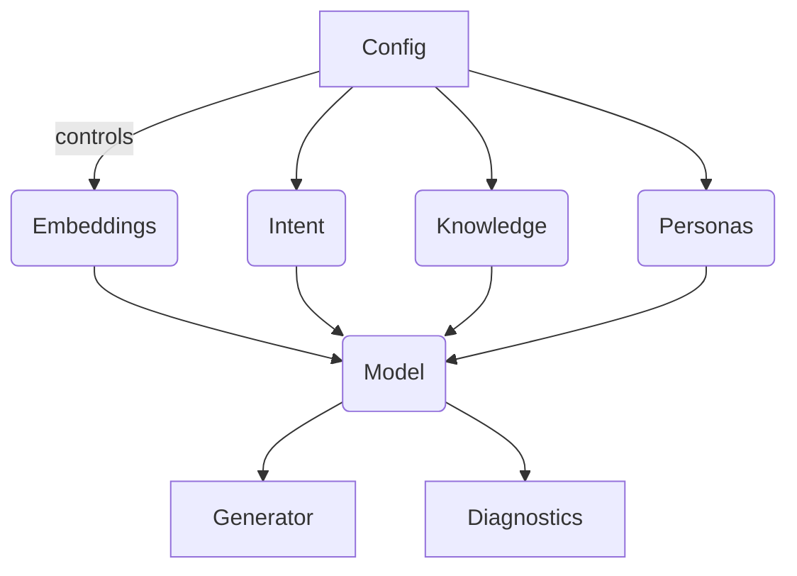

# Architecture Overview

The refactored package is organised around a clear set of modules:

- **`semantic_lexicon.config`** – Dataclasses that serialise configuration to
  YAML/JSON and define defaults for embeddings, trainer options, and workspace
  paths.
- **`semantic_lexicon.embeddings`** – NumPy-based embedding management with
  caching and deterministic OOV handling.
- **`semantic_lexicon.intent`** – Lightweight perceptron-style classifier for
  the canonical intent labels used by the project.
- **`semantic_lexicon.knowledge`** – In-memory knowledge network tracking
  concept relationships.
- **`semantic_lexicon.generator`** – Persona-aware generator that blends prompt
  keywords with persona embeddings.
- **`semantic_lexicon.training`** – Corpus normalisation and training helpers.
- **`semantic_lexicon.diagnostics`** – Structured diagnostics with optional
  pandas integration and rich output.

Automation pipelines combine these modules to provide `semantic-lexicon`
commands for preparing corpora, training models, producing diagnostics, and
serving persona-conditioned responses.
