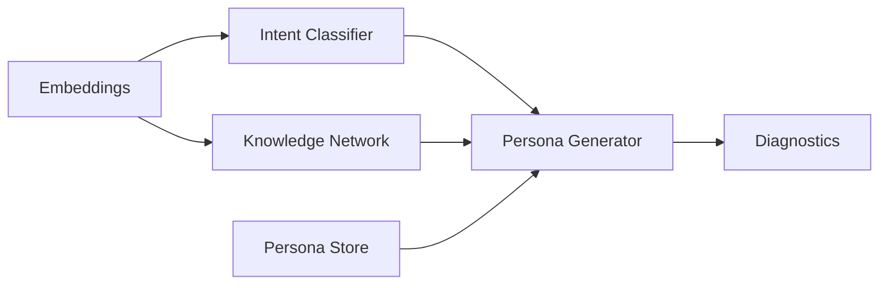

# Semantic Lexicon

Welcome to the Semantic Lexicon documentation. This site walks through the architecture, configuration, and automation flows that power the persona-aware semantic modelling toolkit.

- Learn how to install the package and explore the CLI.
- Review the modular architecture and extension points.
- Dive into the API reference for programmatic usage.

## Getting Started

1. `pip install .[dev,docs]`
2. `semantic-lexicon prepare --intent src/semantic_lexicon/data/intent.jsonl --knowledge src/semantic_lexicon/data/knowledge.jsonl`
3. `semantic-lexicon train`
4. `semantic-lexicon diagnostics`
5. `semantic-lexicon generate "Explain neural networks" --persona tutor`

Consult the [User Guide](user-guide.md) for detailed workflows.
